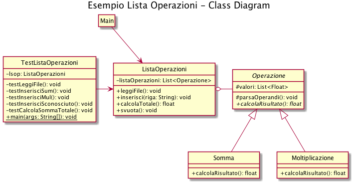

# Esempio Lista Operazioni

Questo è un semplice esempio per riepilogare:

- come organizzare un progetto java in sottocartelle;
- come creare dei test senza usare librerie specifiche (come JUnit);
- come compilare ed eseguire codice java da riga di comando;
- come generare dei diagrami uml in maniera dichiarativa a partire da file di testo;
- come generare la javadoc.

## Diagramma UML generato con PlantUML

[PlantUML](https://plantuml.com) è un tool per la generazione dichiarativa di diagrammi UML. Permette ad esempio di definire diagrammi delle classi e di sequenza tramite file di testo invece che mediante un editor visuale. Ci sono vari modi per poter usare plantUML:

- da riga di comando scaricando ed eseguendo il jar come indicato [qui](https://plantuml.com/starting)

- usando un [editor online](https://www.planttext.com)

- scaricando un'[estensione per vscode](https://marketplace.visualstudio.com/items?itemName=jebbs.plantuml)

Questo è un esempio di diagramma delle classi generato con PlantUML a partire dal file [*docs/uml/class_diagram.puml*](docs/uml/class_diagram.puml):



## Compilare i sorgenti da riga di comando

L'opzione *"-d"* serve ad indicare la directory in cui generare i ".class", ad esempio in una cartella "bin" per separarli dai sorgenti.

```bash
javac src/* -d bin
```

## Eseguire il main e i test da riga di comando

L'opzione *"-cp"* serve ad indicare il classpath, ovvero dove cercare i class file (nella cartella bin, in questo caso):

```bash
java -cp bin Main
java -cp bin TestListaOperazioni
```

Esempio di output per i test:

```bash
OK testLeggiFile
OK testInserisciMul
OK testInserisciSum
OK testInserisciSconosciuto
OK testCalcolaSommaTotale
```

## Generare la javadoc da riga di comando

L'opzione *-d* serve ad indicare la directory in cui generare la javadoc:

```bash
javadoc src/* -d docs/site
```
